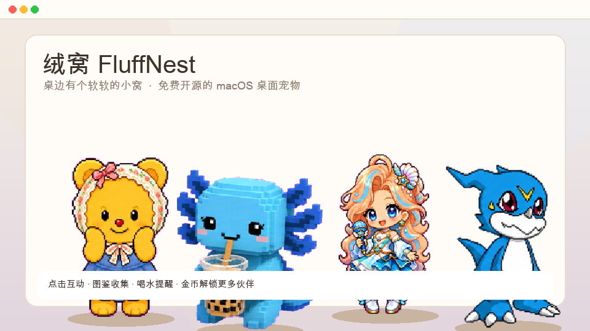

# 绒窝 FluffNest

<p align="center">
  
</p>

<p align="center">
  <strong>桌边有个软软的小窝</strong><br/>
  macOS 萌系桌面宠物 · 多宠图鉴 · 点击互动 · 温和提醒 · 免费开源
</p>

<p align="center">
  <a href="https://github.com/zhaizhch/fluffnest/releases/latest"></a>
  <a href="https://github.com/zhaizhch/fluffnest/releases"></a>
  <a href="https://github.com/zhaizhch/fluffnest/stargazers"></a>
  
</p>

<p align="center">
  <a href="https://github.com/zhaizhch/fluffnest/releases/latest"><strong>⬇ 立刻下载最新版</strong></a>
  ·
  <a href="./docs/用户安装指南.md">安装指南</a>
  ·
  <a href="https://github.com/zhaizhch/fluffnest/issues">反馈问题</a>
</p>

### 技能演示 · 空间跳跃

<p align="center">
  
  &nbsp;
  
</p>

<p align="center"><sub>扫帚魔女 · 暖卡卡 — 空间跳跃（warp）</sub></p>

---

## 30 秒了解

绒窝会在你的 Mac **桌角常驻**一只软软伙伴：眨眼、小蹦跳、点一点就有对话。  
提醒你喝水、起身；用金币解锁图鉴里更多宠物。适合摸鱼陪伴，不打扰专注。

| | |
|--|--|
| 平台 | **仅 macOS** 12+（Apple Silicon / Intel） |
| 价格 | **免费开源**（GitHub Releases） |
| 安装 | 下载 DMG → 拖进「应用程序」 |
| 数据 | 仅保存在本机，不上传账号 |

---

## 下载安装

### 1. 选对芯片

打开「终端」执行 `uname -m`：

| 输出 | 下载 |
|------|------|
| `arm64` | [**FluffNest_*_aarch64.dmg**](https://github.com/zhaizhch/fluffnest/releases/latest)（M1 / M2 / M3 / M4） |
| `x86_64` | [**FluffNest_*_x86_64.dmg**](https://github.com/zhaizhch/fluffnest/releases/latest)（Intel） |

到 **[Releases · 最新版](https://github.com/zhaizhch/fluffnest/releases/latest)** 的 Assets 里点对应文件。

### 2. 安装

1. 双击打开 `.dmg`
2. 把 **FluffNest** 拖进 **应用程序**
3. 从启动台或「应用程序」打开

### 3. 打不开 / 提示已损坏？

未公证时 macOS 会拦一下。任选其一：

**右键打开**：在「应用程序」里右键 FluffNest → **打开** → 再点打开  

或终端：

```bash
xattr -cr /Applications/FluffNest.app
```

完整排障见 **[用户安装指南](./docs/用户安装指南.md)**。

---

## 功能亮点

| 能力 | 说明 |
|------|------|
| 桌面常驻 | 透明置顶窗；菜单栏托盘可显示 / 隐藏 / 打开面板 |
| 多宠图鉴 | 毛绒、人型、偶像、数码、奇幻等分类；收集进度与徽章 |
| 养成节奏 | 互动耗体力、闲置回体力；每日好感有上限；登录礼需手动领取 |
| 点击互动 | 单击随机动作 + 气泡；拖动移动位置 |
| 温和提醒 | 喝水、久坐、手动会议；打卡得金币 |
| 绒窝小铺 | 金币解锁宠物 |

<p align="center">
  
</p>

---

## 怎么玩

| 操作 | 效果 |
|------|------|
| 拖拽宠物 | 移动窗口（移动超过约 6px 才算拖） |
| 单击宠物 | 随机互动 + 对话 |
| 双击 / 右键 | 打开绒窝面板 |
| 菜单栏图标 | 显示 / 隐藏、打开面板、退出 |

面板：状态 · 图鉴 · 提醒 · 小铺 · 设置。

---

## 文档

- [用户安装指南](./docs/用户安装指南.md) — 下载、安装、Gatekeeper
- [方案 v1](./docs/方案-v1.md) — 产品与实现对齐
- [部署方案](./docs/部署方案.md) — 发版与 CI

欢迎 **Star**、提 [Issue](https://github.com/zhaizhch/fluffnest/issues)，或把试用截图发回来——早期反馈最有用。

---

## 开发者

环境：macOS 12+、Node 20+、Rust stable、Xcode CLT。

```bash
git clone https://github.com/zhaizhch/fluffnest.git
cd fluffnest
npm install
npm run tauri:dev
```

```bash
npm run tauri:build          # 打 .app
npm run release:package      # 当前架构发布包
./scripts/bump-version.sh 0.2.2
python3 scripts/make-demo-assets.py   # 重新生成 README Demo 图
```

推送 `v*` tag 后，Actions 会构建 aarch64 + x86_64 并写入 Release。

```bash
npx tsx scripts/verify-quiet-schedule.ts
npx tsx scripts/verify-pet-roster.ts
npx tsx scripts/verify-bond-collect.ts
```

---

## 品牌

| | |
|--|--|
| 中文名 | 绒窝 |
| 英文名 | FluffNest |
| Bundle ID | `com.fluffnest.deskpet` |
| Slogan | 桌边有个软软的小窝 |

技术栈：Tauri 2 · React · TypeScript · Rust · Canvas 2D（Codex 精灵图集）

---

## License

私有 / 未声明许可前请勿二次分发商业素材图集。应用代码以仓库内声明为准。
